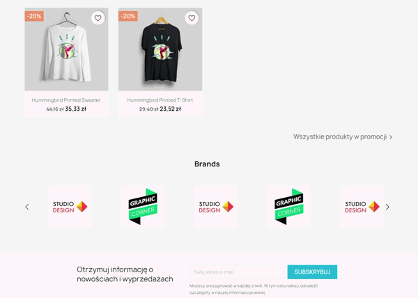
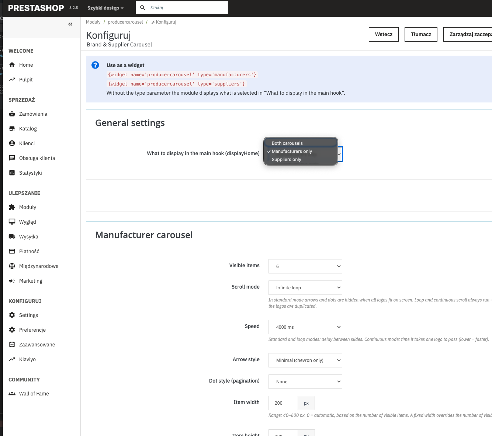

# Brand & Supplier Carousel for PrestaShop

A PrestaShop 8/9 module that shows manufacturer and supplier logos in two independent, configurable carousels — as a `displayHome` block or as a widget in any hook or template.



## Why this exists

- *The native Brand list module (`ps_brandlist`) shows names as a plain list or a dropdown — how do I show the logos as a carousel, and suppliers too?*
- *How do I put only the brands on the home page and only the suppliers in the footer?*
- *Can the logos scroll as an endless ticker, with arrows and dots that match my theme?*

This module answers those with native PrestaShop data (no duplicated logos to upload), per-carousel settings in the back office, and a locally bundled slider — no CDN, no external requests.

## What's inside

| Feature | Details |
|---|---|
| **Two independent carousels** | Manufacturers and suppliers, each with its own settings and its own include/exclude list |
| **Scroll modes** | Standard (stops at the end), infinite loop, continuous ticker (constant linear scroll) |
| **Autoplay speed** | Off or 2–10 s between slides; in ticker mode, the time one logo takes to pass |
| **Arrow styles** | None, minimal chevron, filled circle, outlined square |
| **Pagination styles** | None, dots, lines, dynamic (scaled) dots |
| **Dimensions** | Item width, item height and gap entered in px, or automatic |
| **Widget support** | `{widget name='producercarousel' type='manufacturers'}` — `type` is `all`, `manufacturers` or `suppliers` |
| **Accessibility** | Keyboard-focusable controls, labelled buttons, duplicated slides hidden from screen readers, autoplay off with `prefers-reduced-motion` |
| **Translations** | English source strings, Polish catalogue included (`translations/pl-PL`) |

## Install

No command line needed — the module installs from the PrestaShop back office.

1. Download **`producercarousel.zip`** from the [latest release](https://github.com/Breczek/producercarousel/releases/latest).
   Use this file, not GitHub's *Source code (zip)* — PrestaShop needs the folder inside the archive to be named exactly `producercarousel`.
2. In the back office go to **Modules → Module Manager** and click **Upload a module**.
3. Drop the ZIP file into the window. PrestaShop installs the module and offers **Configure**.

**Updating:** upload the newer `producercarousel.zip` the same way — your settings are kept. If labels still show the old wording, clear the cache in **Advanced Parameters → Performance**.

<details>
<summary>For developers: install from Git</summary>

```bash
cd /path/to/prestashop/modules
git clone https://github.com/Breczek/producercarousel.git producercarousel
```

Then install the module in **Modules → Module Manager**. To update, run `git pull` in the module folder, run **Upgrade** in the Module Manager if PrestaShop offers it, and clear the cache.

</details>

## How to use

- **Home page:** the module hooks into `displayHome`. The *General settings* section chooses whether it shows both carousels, manufacturers only or suppliers only.
- **Anywhere else:** place a widget in a template:

  ```smarty
  {widget name='producercarousel' type='manufacturers'}
  {widget name='producercarousel' type='suppliers'}
  ```

- **Choosing logos:** every active manufacturer/supplier is shown by default; uncheck the ones to hide. Newly created ones appear automatically.
- **Colours:** arrows and pagination follow two CSS custom properties you can override in your theme:

  ```css
  .producer-carousel {
    --producer-carousel-accent: #24b9d7;
    --producer-carousel-accent-contrast: #fff;
  }
  ```

Each carousel is configured separately in the back office:



Design decisions and the reasoning behind them are documented in [`decisions.md`](decisions.md).

## Requirements

- **PrestaShop:** 8.x and 9.x (declared compatibility `8.0.0`–`9.99.99`).
- **Tested on:** PrestaShop 8.2.8 with the Classic theme.
- **Slider:** [Swiper](https://swiperjs.com) 12.2.0, bundled in `views/vendor/swiper` (MIT).

## Contributing

Issues and pull requests are welcome — PrestaShop keeps moving. Please include the PrestaShop version and theme you observed the behaviour on.

Releases are built automatically: pushing a tag like `v1.2.0` (matching the version in `producercarousel.php` and `config.xml`) creates a GitHub release with the installable `producercarousel.zip`.

Code style: PSR-2, checked with PHP_CodeSniffer:

```bash
composer install
composer cs
```

## License

[MIT](LICENSE). Swiper is distributed under its own [MIT license](views/vendor/swiper/LICENSE).

## Author

Marcin Bręczewski ([@Breczek](https://github.com/Breczek)) — PrestaShop and WordPress developer.
